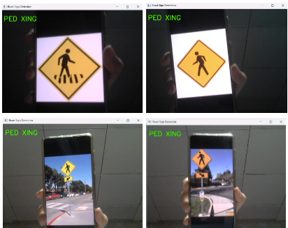
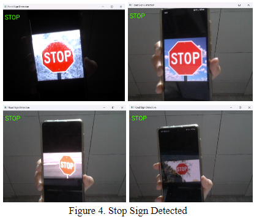
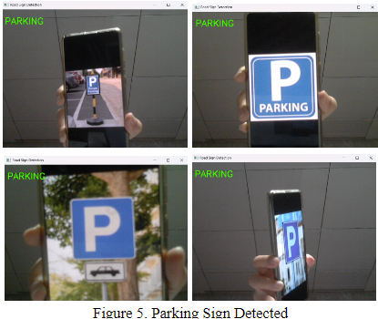

# Traffic Sign Detection using CNN and OpenCV

This project implements a real-time Traffic Sign Recognition System (TSRS) using OpenCV for image processing and a Convolutional Neural Network (CNN) built with TensorFlow/Keras for classification. The system detects and classifies Stop, Pedestrian Crossing (PED XING), and Parking signs from a live webcam feed.

Based on the paper: *Traffic Sign Detection System using Convolutional Neural Network and Computer Vision* by Cua, Ocampo, Roque, and Soriano.

## Features

*   **Real-time Detection:** Processes live video feed from a webcam.
*   **Image Preprocessing:** Uses grayscale conversion, Gaussian blur, and Canny edge detection.
*   **Contour Detection:** Identifies potential sign regions using OpenCV's `findContours`.
*   **CNN Classification:** Employs a trained Keras CNN model (`.h5` file) to classify detected regions into predefined sign categories (Stop, Ped Xing, Parking).
*   **Visual Feedback:** Displays the live feed with bounding boxes and predicted labels (including confidence score) drawn around detected signs.
## Screenshots






## Technology Stack

*   **Programming Language:** Python 3
*   **Libraries:**
    *   TensorFlow / Keras (for CNN model building and loading)
    *   OpenCV (for image processing, contour detection, video capture)
    *   NumPy (for numerical operations)

## Setup

1.  **Prerequisites:**
    *   Python 3.8+
    *   Pip (Python package installer)
    *   Git

2.  **Clone the Repository:**
    ```bash
    git clone <your-repository-url>
    cd traffic-sign-detection
    ```

3.  **(Recommended) Create and Activate Virtual Environment:**
    ```bash
    python -m venv venv
    # On Windows
    venv\Scripts\activate
    # On macOS/Linux
    source venv/bin/activate
    ```

4.  **Install Dependencies:**
    ```bash
    pip install -r requirements.txt
    ```
    *Note: TensorFlow installation might require specific steps depending on your hardware (CPU/GPU). Refer to the official TensorFlow documentation.*

5.  **Prepare the Dataset (`dataset/` folder):**
    *   This repository **does not** include the image dataset.
    *   You need to create a folder named `dataset` in the project's root directory.
    *   Inside `dataset`, create subfolders for each traffic sign class exactly as named:
        *   `dataset/STOP/`
        *   `dataset/PED XING/`
        *   `dataset/PARKING/`
    *   Populate each subfolder with corresponding images (.jpg, .png, etc.). The more diverse images per class, the better the model training.
    *   **Important:** The `trainer.py` script currently uses a relative path `dataset`. Ensure this structure is correct or modify the `DATASET_PATH` variable in `trainer.py`.

6.  **Train the Model (or Obtain Pre-trained Model):**
    *   Run the training script:
        ```bash
        python trainer.py
        ```
    *   This will process the images in your `dataset` folder, train the CNN, and save the trained model as `models/road_sign_model.h5`.
    *   Alternatively, if you have a pre-trained `road_sign_model.h5` file, place it inside the `models` folder.

## Usage

1.  **Ensure Setup is Complete:** Make sure you have installed dependencies, prepared the dataset, and have the `models/road_sign_model.h5` file (either by training or placing it there).

2.  **Run the Detection Application:**
    ```bash
    python app.py
    ```

3.  **Operation:**
    *   A window titled "Traffic Sign Detection" will open, showing your webcam feed.
    *   Point the webcam towards traffic signs (Stop, Ped Xing, Parking).
    *   If a sign is detected with sufficient confidence, a green bounding box and the predicted label (e.g., "STOP (0.95)") will appear around it.
    *   The status is also displayed in the top-left corner.
    *   Press the 'q' key to quit the application.

## File Structure
traffic-sign-detection/
├── .gitignore # Files/folders ignored by Git
├── LICENSE # Project license (MIT)
├── README.md # This file
├── app.py # Main script for real-time detection
├── trainer.py # Script to train the CNN model
├── requirements.txt # Python dependencies
├── dataset/ # Root folder for training images (needs user population)
│ ├── STOP/ # Images for STOP signs
│ ├── PED XING/ # Images for Pedestrian Crossing signs
│ ├── PARKING/ # Images for Parking signs
│ └── (.gitkeep) # Placeholder
└── models/ # Folder for the trained model
└── (road_sign_model.h5) # Generated by trainer.py
└── (.gitkeep) # Placeholder

## Potential Improvements

*   **Data Augmentation:** Add more aggressive data augmentation in `trainer.py` for better robustness.
*   **Model Optimization:** Experiment with different CNN architectures, hyperparameters, or use pre-trained models (transfer learning).
*   **Error Handling:** Add more robust error handling in `app.py`.
*   **Tracking:** Implement object tracking (e.g., using Kalman filters or deep sort) for smoother detection across frames.
*   **Configuration File:** Move paths and parameters (thresholds, image size) to a separate configuration file (e.g., YAML, JSON).
*   **Add More Signs:** Expand the dataset and retrain the model to recognize a wider variety of traffic signs.

## Authors

*   Nathanael Adrian T. Cua
*   Kristina Diana L. Ocampo
*   Cecilia Angeline J. Roque
*   Daniel Iñigo M. Soriano

## License

This project is licensed under the MIT License - see the [LICENSE](LICENSE) file for details.
